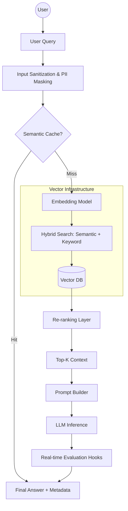

# Enterprise-Grade RAG: Document Intelligence System

> From “chatbot over PDFs” to a production-style architecture: retrieval, evaluation, observability, and deployment in one repo.

---

## 1. Problem Statement

Manual document review is slow, expensive, and error-prone.

Example scenario:
- Domain: Compliance / Legal
- Volume: ~10,000 documents/month
- Baseline: ~8 minutes per document for manual review

**Goal**
Reduce review time per document while:
- Maintaining high answer *faithfulness* to source text
- Controlling hallucinations
- Keeping per-query cost below a defined threshold

---

## 2. High-Level Architecture

This system goes beyond a simple LangChain notebook. It implements:

- Input sanitization and PII masking
- Semantic caching for repeated queries
- Hybrid retrieval (keyword + vector search)
- Re-ranking using a cross-encoder / reranker
- LLM inference with strict grounding prompts
- Automated evaluation with RAG metrics
- Containerized API for deployment

Mermaid overview:



---

## 3. Features

- 🔒 **Input Guardrails**
  - PII detection and masking
  - Basic prompt injection heuristics

- 🚀 **Retrieval**
  - Hybrid retrieval (BM25 + vector search)
  - Tunable `top_k`, chunk sizes, and overlap

- 🎯 **Reranking**
  - Cross-encoder / reranker to improve context precision
  - Configurable scoring threshold

- 🧠 **LLM Orchestration**
  - Grounded prompts (answers must cite context)
  - Optional “self-check” pass to reduce hallucination

- 📊 **Evaluation**
  - Golden dataset (100+ Q&A pairs)
  - Batch evaluation with RAG metrics (faithfulness, relevance, context precision)
  - Scorecard generation

- 📦 **Deployment**
  - FastAPI-based inference server
  - Dockerfile for containerization
  - Ready to run behind a load balancer

---

## 4. Tech Stack

- Backend: FastAPI / Python
- Orchestration: LangChain / LangGraph (configurable)
- Vector DB: Pinecone / Weaviate / Qdrant (pluggable)
- LLMs: Azure OpenAI / OpenAI GPT-4o (configurable)
- Evaluation: RAGAS / custom evaluators
- UI: Streamlit or simple web client (optional folder)

---

## 5. Getting Started

### 5.1. Prerequisites

- Python 3.10+
- Docker (optional but recommended)
- API keys:
  - OpenAI / Azure OpenAI
  - Vector DB provider (Pinecone / etc.)

### 5.2. Setup

```bash
git clone https://github.com/<your-username>/enterprise-rag-doc-intel.git
cd enterprise-rag-doc-intel

python -m venv .venv
source .venv/bin/activate  # Windows: .venv\Scripts\activate

pip install -r requirements.txt
cp .env.example .env  # fill in keys
```

---

## 6. Usage

### 6.1. Index Your Documents

```bash
python scripts/index_documents.py --data_dir ./data/docs
```

- Splits docs into chunks
- Creates embeddings
- Uploads vectors to configured DB

### 6.2. Run the API Server

```bash
uvicorn app.main:app --reload
```

Endpoint example:

```http
POST /query
{
  "question": "What is the penalty for breach of clause 4?",
  "max_context": 5
}
```

Response includes:
- `answer`
- `source_chunks`
- `metrics` (if evaluation hooks enabled)

---

## 7. Evaluation Framework

This repo includes a full evaluation pipeline.

### 7.1. Golden Dataset

`data/golden_dataset.json`:
- 100+ Q&A pairs
- Each entry has:
  - `question`
  - `expected_answer`
  - `reference_docs` (optional)

### 7.2. Running Evaluation

```bash
python scripts/run_evaluation.py \
    --dataset data/golden_dataset.json \
    --output results/scorecard.json
```

Metrics:
- Faithfulness
- Answer relevance
- Context precision

Example results:

```json
{
  "faithfulness": 0.87,
  "answer_relevance": 0.91,
  "context_precision": 0.83
}
```

### 7.3. Iteration Loop

Use `notebooks/eval_analysis.ipynb` to:
- Analyze low-scoring questions
- Experiment with:
  - chunk sizes
  - top_k
  - prompt templates

---

## 8. Deployment (Docker + Infra Sketch)

### 8.1. Docker

```bash
docker build -t enterprise-rag-doc-intel .
docker run -p 8000:8000 --env-file .env enterprise-rag-doc-intel
```

### 8.2. Suggested Production Setup

- API behind Nginx / API gateway
- Autoscaling (Kubernetes / ECS)
- Redis or similar cache for semantic hits
- Centralized logging and tracing (e.g., LangSmith / Arize, OpenTelemetry)

`docs/infra-diagram.md` contains an architecture sketch and notes on scaling to higher traffic.

---

## 9. “Scars”: What Broke and How I Fixed It

This is the most important section if you’re reading this as a hiring manager.

### 9.1. Token Cost

- Problem: Initial design cost ~\$0.08 per query on average.
- Fixes:
  - Compressed prompts and removed redundant instructions.
  - Used a smaller `gpt-4o-mini`-class model for simple lookups.
  - Summarized long context before sending to LLM.
- Result: Cost reduced by ~40%, with minimal quality loss.

### 9.2. Latency

- Problem: Retrieval latency too high due to large embeddings and high `top_k`.
- Fixes:
  - Switched to lower-dimension embeddings.
  - Reduced `top_k`, added reranking to maintain quality.
- Result: ~200ms improvement in average response time.

### 9.3. Hallucinations

- Problem: Occasionally, the model added clauses not present in contracts.
- Fixes:
  - Enforced “answer only from context” instructions.
  - Implemented a self-check step comparing the answer to context.
  - Flagged low-confidence answers for human review.
- Result: Significant reduction in hallucinations, more predictable behavior.

---

## 10. Interview-Ready Talking Points

This project is designed to answer questions like:

- How do you design a scalable RAG system for large corpora?
- How do you evaluate and improve a GenAI system?
- How do you reduce cost/latency without killing quality?
- How do you handle prompt injection and PII in production?

See `docs/interview-notes.md` for detailed answers and diagrams you can use in interviews.

---

## 11. Roadmap

- [ ] Add multi-tenant support
- [ ] Plug in additional vector DB backends
- [ ] UI for managing golden dataset and feedback
- [ ] Deeper observability dashboards

---

## 12. License

MIT (or your choice)
